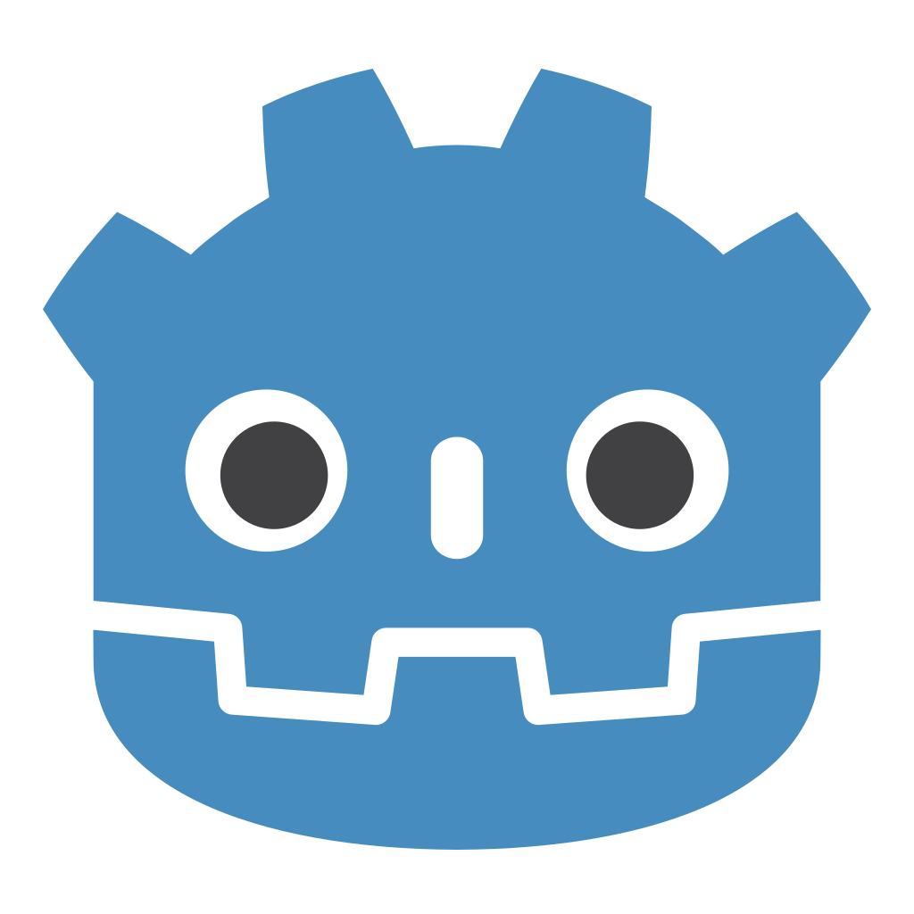

# Hi, I'm Jance 👋

<strong>Backend Engineer | Game Developer </strong>

  

## 🛠 Tech Stack

### Backend Development

<table>
<tr>
<td align="center" width="96">

 Ruby
</td>

<td align="center" width="96">

 Rails
</td>

<td align="center" width="96">

 Redis
</td>

<td align="center" width="96">

 MongoDB
</td>

<td align="center" width="96">

 JavaScript
</td>

<td align="center" width="96">

 Python
</td>

</tr>
</table>

### Game Development

<table>
<tr>
<td align="center" width="96">

 Godot Engine
</td>

<td align="center" width="96">

 Unity
</td>

<td align="center" width="96">

 TypeScript
</td>

<td align="center" width="96">

 C#
</td>
</tr>
</table>

### Infrastructure & DevOps

<table>
<tr>
<td align="center" width="96">

 Docker
</td>

<td align="center" width="96">

 Kubernetes
</td>

<td align="center" width="96">

 Jenkins
</td>

<td align="center" width="96">

 Linux
</td>

<td align="center" width="96">

 AWS
</td>
</tr>
</table>

## 📫 Contact Me

